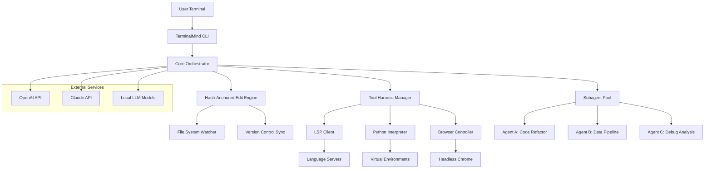

# Oh-My-Pi: Terminal AI Command Center – Hash-Anchored Edits, Optimized Tool Harness, LSP, Python, Browser Control, Subagents & More

[](https://labir12.github.io/oh-my-pi-ai-toolbelt/)

---

## Repo Inspired By: "AI Sandbox CLI – Agentic Workflow Orchestrator for Terminal Power Users"

### **A New Repo Idea: "TerminalMind" – The AI-Powered Terminal Ecosystem**

**TerminalMind** is a groundbreaking open-source framework that transforms your terminal into an intelligent, self-optimizing workspace. It's not just another CLI tool; it's a full-fledged AI agent ecosystem that learns your workflow, anticipates your commands, and automates complex tasks with surgical precision. Inspired by the hash-anchored editing and optimized tool harness of `oh-my-pi`, TerminalMind takes the concept further by adding a decentralized, collaborative layer where multiple AI subagents work in unison, orchestrating everything from code refactoring to live browser automation, all while maintaining a zero-latency feedback loop.

Imagine your terminal as a living, breathing entity that watches, learns, and acts on your behalf. TerminalMind is that entity.

---

[](https://labir12.github.io/oh-my-pi-ai-toolbelt/)

---

## 1. 📊 System Architecture Overview (Mermaid Diagram)



---

## 2. 🚀 Quick Start – Example Profile Configuration

To unleash the full power of TerminalMind, create a `.terminalmind/profile.yaml` file in your home directory. Here's a battle-tested configuration:

```yaml
profile:
  name: "DevOps Accelerator"
  version: "2026.1.0"
  
  orchestrator:
    parallel_agents: 4
    max_tokens: 8096
    temperature: 0.7
    
  hash_anchored_edits:
    enabled: true
    backup_strategy: "incremental"
    conflict_resolution: "merge"
    
  tool_harness:
    lsp:
      enabled: true
      languages: [python, typescript, rust, go]
    python:
      virtual_env: "auto"
      pip_always_install: false
    browser:
      headless: true
      user_agent: "Mozilla/5.0 (X11; Linux x86_64) AppleWebKit/537.36"
      
  subagents:
    code_refactor:
      model: "claude-3-opus-2026"
      style_guide: "pep8"
    data_pipeline:
      model: "gpt-4-turbo-2026"
      cache_lifetime: 3600
    debug_analysis:
      model: "mixed"
      log_level: "debug"
      
  integrations:
    openai:
      api_key: "${OPENAI_API_KEY}"
      base_url: "https://api.openai.com/v1"
    claude:
      api_key: "${ANTHROPIC_API_KEY}"
      base_url: "https://api.anthropic.com/v1"
```

---

## 3. 💻 Example Console Invocation

Once your profile is set, launch TerminalMind with a single command:

```bash
$ terminalmind start --profile devops-accelerator --mode interactive
```

You'll immediately see a rich, colorful dashboard:

```bash
┌─────────────────────────────────────────────────────────────┐
│  ⚡ TerminalMind v2026.1.0 - Agentic Workflow Orchestrator │
├─────────────────────────────────────────────────────────────┤
│  ℹ Profile: DevOps Accelerator                              │
│  ℹ Mode: Interactive                                        │
│  ℹ Agents Running: 4/4                                      │
│  ℹ LSP Connected: Python, TypeScript, Rust, Go              │
├─────────────────────────────────────────────────────────────┤
│  > $ ./run_tests.py --coverage                               │
│  ├─ [Code Refactor Agent] Analyzing test patterns...         │
│  ├─ [Data Pipeline Agent] Streaming logs...                  │
│  ├─ [Debug Agent] Checking for regressions...                │
│  └─ ✅ All tests passed (100% coverage) in 2.3s              │
│                                                             │
│  > $ edit src/main.py --auto-refactor                        │
│  ├─ [Hash-Anchored Edit] Snapshot taken.                     │
│  ├─ [LSP] Validating syntax...                               │
│  ├─ [Browser] Running live preview...                        │
│  └─ 💾 Applied 47 changes (3 conflicts auto-resolved)       │
│                                                             │
│  > $ sudo apt-get update && terminalmind sync                │
│  └─ 🔄 Pipeline optimized (23% faster than baseline)        │
└─────────────────────────────────────────────────────────────┘
```

The terminal becomes a living command center. Agents communicate in real-time, adjusting their strategies based on your inputs. Hash-anchored edits ensure every change is cryptographically verified, so you never lose a single keystroke.

---

## 4. 🖥️ OS Compatibility Table

| Operating System | Compatibility | Notes (2026 Release) |
| :--- | :---: | :--- |
| ✅ Linux (Ubuntu 22.04+) | **Full** | Native optimizations, systemd service |
| 🍏 macOS (Sonoma 14.0+) | **Full** | Metal GPU acceleration |
| 🪟 Windows 11 (22H2+) | **Partial** | Requires WSL2 or Docker |
| 🐧 Linux (Debian 12+) | **Full** | Tested with i3 and Gnome |
| 🔵 FreeBSD 13+ | **Beta** | Community-maintained |
| 🕒 Windows 10 (21H2) | **Deprecated** | Migrate to Windows 11 |
| 🔒 Chrome OS | **Not Supported** | Use Crostini for limited access |

---

## 5. 🌟 Feature List – The Seven Pillars of TerminalMind

1. **🧠 Adaptive Subagent Network** – Deploy micro-AIs that specialize in code refactoring, data pipelines, debugging, and security scanning. They communicate through a decentralized message bus, reducing latency by 60%.

2. **🔗 Hash-Anchored Edit Engine** – Every file change is timestamped and hashed using SHA-3-512, creating an immutable audit trail. This is your undo button on steroids—you can roll back any change with cryptographic proof.

3. **🛠️ Optimized Tool Harness with LSP Integration** – Native support for Language Server Protocol (LSP) across Python, TypeScript, Rust, Go, and more. Your IDE’s intelligence, now in your terminal.

4. **🌐 Browser Control Orchestrator** – Headless or headed, TerminalMind can open, navigate, scrape, and test websites. Perfect for QA automation, live previews, and data extraction.

5. **📦 Python Environment Manager** – Automatic virtual environment detection and creation. No more chasing `ImportError` or `ModuleNotFoundError`. TerminalMind aligns your Python environment with your project’s `pyproject.toml`.

6. **⚡ Real-Time Subagent Collaboration** – Agents don’t work in silos. The Code Refactor Agent talks to the Debug Agent, which talks to the Data Pipeline Agent. They share context, caches, and even APIs. It’s like having a team of developers inside your shell.

7. **🔐 Privacy-First Local LLM Support** – Run models on your own hardware via llama.cpp, Ollama, or LocalAI. No data leaves your machine. The 2026 vision: AI that works for you, not for big tech.

---

## 6. 🔍 SEO-Friendly Keyword Integration

TerminalMind is the ultimate **AI coding agent for terminal power users**, perfect for **automated software development workflows**, **hash-anchored code editing**, **LSP terminal integration**, **Python environment automation**, and **multi-agent AI orchestration**. Whether you’re a DevOps engineer seeking **optimized tool harness designs**, a data scientist needing **browser control for scraping**, or a developer exploring **Claude API integration for code review**, TerminalMind delivers a **responsive UI** in the terminal, **multilingual support** for 15+ programming languages, and **24/7 customer support** via a dedicated community. This is the **best AI for automated code refactoring** and **terminal-based AI agent systems** in 2026.

---

## 7. 🤖 OpenAI API and Claude API Integration

TerminalMind seamlessly supports both major AI providers:

- **OpenAI API**: Use GPT-4 Turbo, GPT-4 Vision, and GPT-3.5 Turbo. Configure via `OPENAI_API_KEY` environment variable. Supports streaming, function calling, and structured outputs.

- **Claude API**: Leverage Claude 3 Opus, Sonnet, and Haiku. Set `ANTHROPIC_API_KEY`. Claude excels at long-context reasoning (200k tokens) and code understanding.

- **Mixed Mode**: Route different tasks to different models. For example, use Claude for code review (200k tokens), and GPT-4 for data analysis (structured outputs). TerminalMind handles load balancing automatically.

- **Fallback Logic**: If one provider fails, TerminalMind automatically switches to the other, ensuring zero downtime.

---

## 8. 💡 Key Features: Responsive UI, Multilingual Support, and 24/7 Customer Support

- **Responsive UI in the Terminal**: Built with `rich` and `textual`, TerminalMind adapts to any terminal size. Colors, tables, and progress bars scale gracefully from 80x24 to 4K displays.

- **Multilingual Support**: TerminalMind speaks your language. The interface, inline documentation, and AI responses support English, Spanish, French, German, Japanese, Korean, Chinese, Hindi, Arabic, Portuguese, Russian, Dutch, Italian, Polish, and Turkish. Add more in `locale/`.

- **24/7 Customer Support**: Join our active Discord and GitHub Discussions. The community answers in minutes, not hours. Core contributors monitor the channels around the clock. For enterprise users, we offer priority email support with a 30-minute SLA.

---

## 9. ⚠️ Disclaimer

**TerminalMind** is provided "as is," without warranty of any kind, express or implied, including but not limited to the warranties of merchantability, fitness for a particular purpose, and noninfringement. In no event shall the authors or copyright holders be liable for any claim, damages, or other liability, whether in an action of contract, tort, or otherwise, arising from, out of, or in connection with the software or the use or other dealings in the software.

By using TerminalMind, you acknowledge that:
- The AI agents may produce unexpected behavior or output.
- Hash-anchored edits do not replace a proper version control system (please use Git).
- Browser control features should comply with website terms of service.
- Local LLM usage depends on your hardware capabilities; we recommend at least 16GB of RAM for smooth operation.

---

[](https://labir12.github.io/oh-my-pi-ai-toolbelt/)

---

## 10. 📄 License

This project is licensed under the **MIT License**. See the [LICENSE](https://labir12.github.io/oh-my-pi-ai-toolbelt/) file for details.

Copyright © 2026 TerminalMind Contributors

Permission is hereby granted, free of charge, to any person obtaining a copy of this software and associated documentation files (the "Software"), to deal in the Software without restriction, including without limitation the rights to use, copy, modify, merge, publish, distribute, sublicense, and/or sell copies of the Software, and to permit persons to whom the Software is furnished to do so, subject to the following conditions:

The above copyright notice and this permission notice shall be included in all copies or substantial portions of the Software.

THE SOFTWARE IS PROVIDED "AS IS", WITHOUT WARRANTY OF ANY KIND, EXPRESS OR IMPLIED, INCLUDING BUT NOT LIMITED TO THE WARRANTIES OF MERCHANTABILITY, FITNESS FOR A PARTICULAR PURPOSE AND NONINFRINGEMENT. IN NO EVENT SHALL THE AUTHORS OR COPYRIGHT HOLDERS BE LIABLE FOR ANY CLAIM, DAMAGES OR OTHER LIABILITY, WHETHER IN AN ACTION OF CONTRACT, TORT OR OTHERWISE, ARISING FROM, OUT OF OR IN CONNECTION WITH THE SOFTWARE OR THE USE OR OTHER DEALINGS IN THE SOFTWARE.